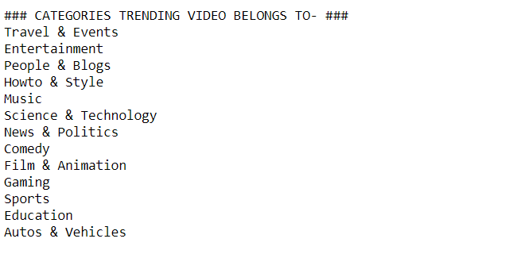
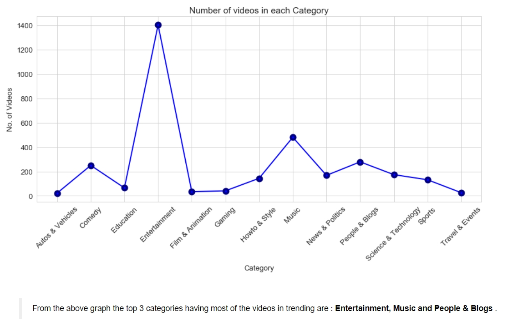
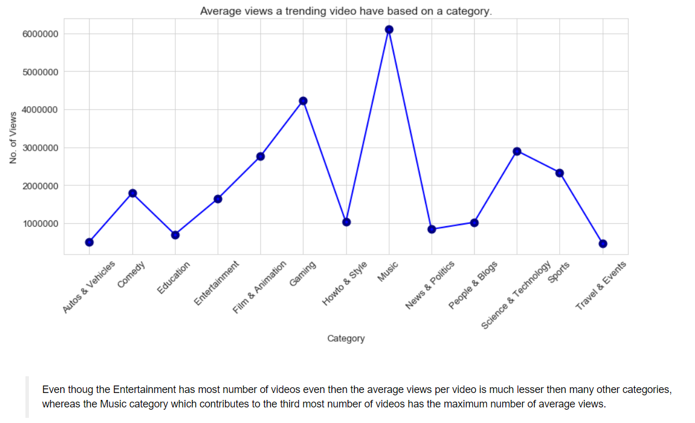
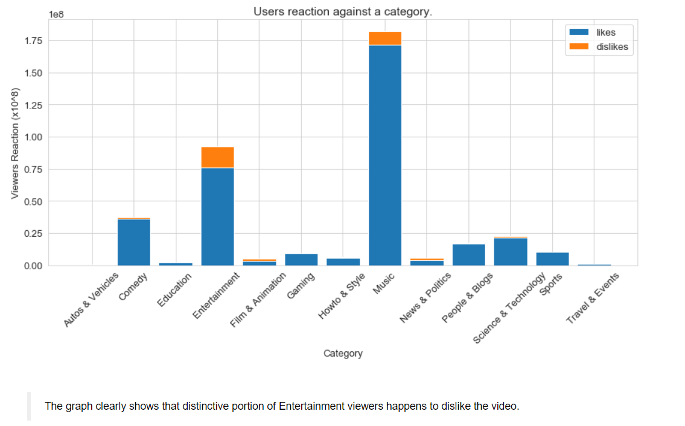
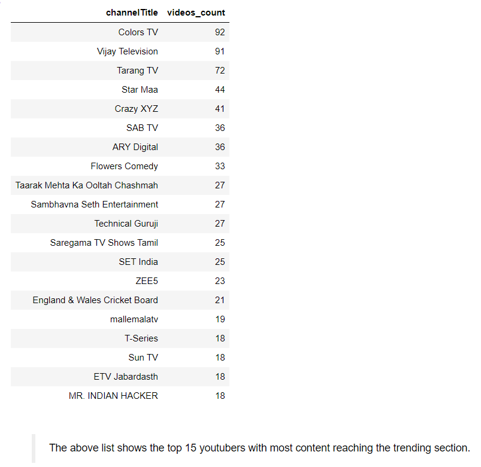
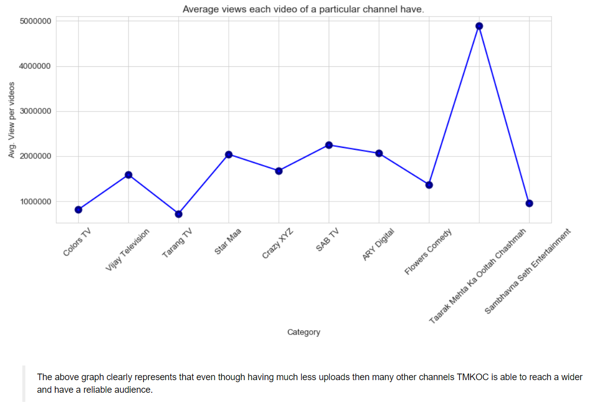
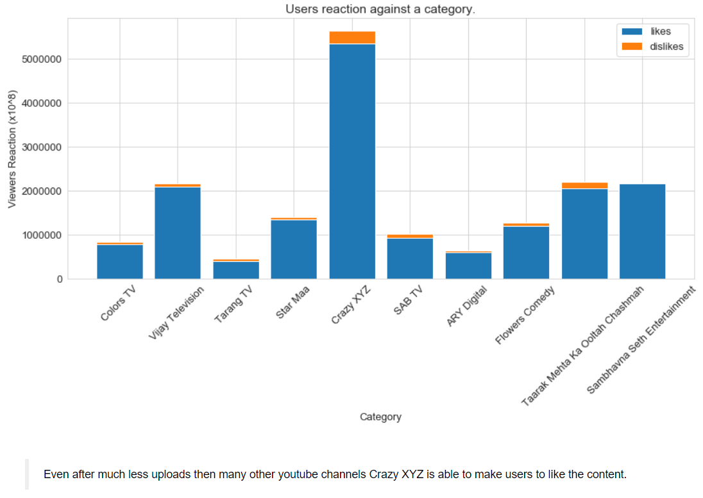

# Youtube Trend Analysis 📈

Analysis of Youtube Trending Videos with Pandas, Numpy, Matplotlib and Seaborn.

## Goal

This project aims to analyze the videos featured in Youtube Trends.

## Objective

To analyze what are the most popular categories, how views differ based on categories, whats are the viewers reactions(Like and Dislike), top Youtube channels creating frequent trending videos and how there viwers be like.

## Libraries

Pandas, Numpy, Matplotlib and Seaborn

## Dataset

From [kaggle](https://www.kaggle.com/rsrishav/youtube-trending-video-dataset) - by [Rishav Sharma](https://www.kaggle.com/rsrishav)

This dataset is a record of the top trending YouTube videos from 12-08-2020 to 10-10-2020.

## Questions the following project will be answering

1. What categories does the trending videos belong to?

   

2. Which category has maximum number of videos between 12-08-2020 to 10-10-2020 in trending section?

   

3. Which category has a better average views per video?

   

4. Which category has a larger user reactions(LIKE and DISLIKE)?

   

5. Which youtube creator has a most content reaching to trending section?

   

6. Which youtube channel has most average views per video?

   

7. Which channel gets the most user reaction in their videos?

   

 * Based on data from 12-08-2020 to 10-10-2020 

## Inferences and Conclusion

1. Out of many categories(genre) only few end up reaching to the trending section.
2. Creators uploading videos frequently have a better chance reaching the trends section.
3. Videos of categories like Entertainment, Music and People & Blog makes major part of the trend listing.
4. Contents of youtube channels of popular pay Television channel are frequent to appear on trends.
